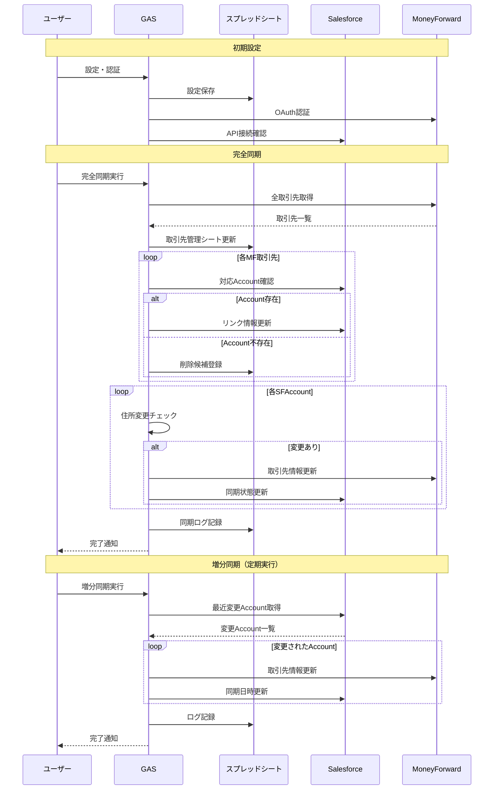
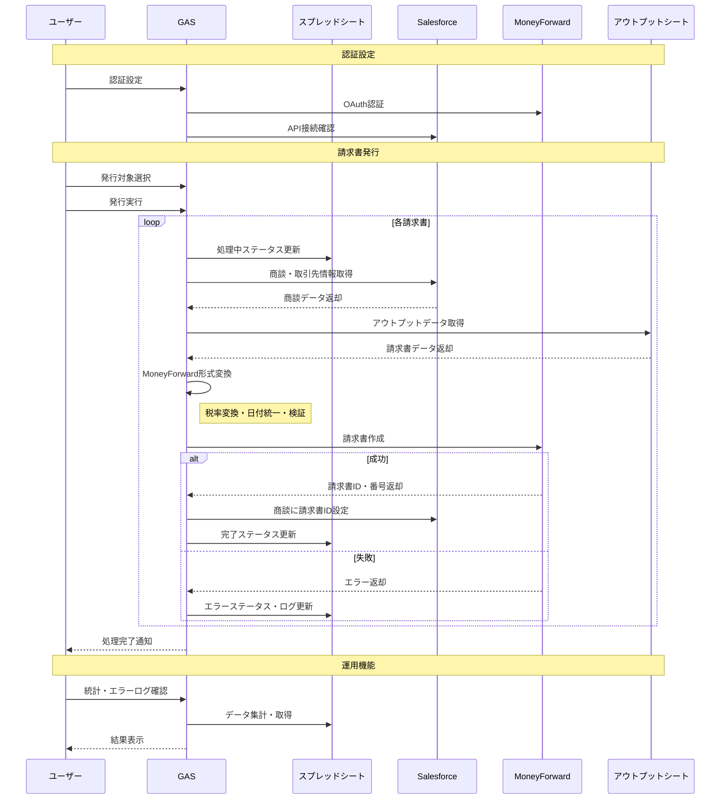

# Salesforce-MoneyForward連携 システム設計概要

## 解決する課題

- 手動データ入力: 月20件×15分 = 年間60時間の非効率
- ヒューマンエラー: 月3件の入力ミス
- 情報の二重管理によるデータ不整合

## 解決アプローチ

- 双方向データ同期による情報統合
- OAuth認証による安全な連携
- 段階的同期による安定運用

## 期待効果

- 年間84,000円のコスト削減
- データ品質100%確保
- 処理時間80%短縮

# 要件詳細

## 1. ビジネスインパクト

### 1.1 定量効果

- **工数削減**: 月20件 × 7分削減 = 140分/月（年間28時間）
- **コスト削減**: 年間28時間 × 3,000円 = **84,000円/年**
- **品質向上**: ヒューマンエラー月3件 → 0件
- **処理速度**: 1件15分 → 3分（80%削減）

### 1.2 ROI

- 開発投資: 約40万円（8週間）
- 年間効果: 84,000円 + 品質向上効果
- 投資回収: 約5年（但し品質向上効果を含めると3年以内）

## 2. 設計判断の根拠

### 2.1 検討内容

**検討した選択肢**:

- 案A: 直接API連携
- 案B: データベース（BigQuery）経由
- 案C: スプレッドシート経由 ←採用

**採用理由**:

- **履歴管理**: 変更履歴の可視性
- **デバッグの容易さ**: 非エンジニアでも状況確認可能
- **運用コスト**: 追加インフラ不要
- **拡張性**: 設定変更が容易

## 3. アーキテクチャの優位性

### 3.1 保守性

- **設定外出し**: スプレッドシートによる設定管理
- **ログ分離**: 各種ログの構造化管理
- **エラー分類**: 種類別のエラーハンドリング

### 3.2 拡張性

- **新システム追加**: API連携部分の抽象化
- **項目追加**: 設定シートでの項目制御
- **承認フロー**: 将来的な承認機能への対応

# 要件定義書

## 1. プロジェクト概要

### 1.1 目的

SalesforceとMoneyForwardを統合し、顧客管理から請求書発行までの業務フローを自動化する。

### 1.2 システム構成

```
[Salesforce] ←→ [Google Apps Script] ←→ [MoneyForward]
                        ↓
                [Google スプレッドシート]
                 (管理・ログ・設定)

```

### 1.3 期待効果

- データ入力作業80%削減
- 請求書発行の自動化
- 顧客情報の整合性確保

## 2. 機能要件

### 2.1 クライアント同期機能

### 2.1.1 認証・設定

- **OAuth 2.0認証**: MoneyForward、Salesforce
- **設定管理**: スプレッドシートによる設定値管理
- **接続テスト**: API接続状態の確認機能

### 2.1.2 データ同期

**完全同期**（月次・手動実行）:

- MoneyForward全取引先取得（ページネーション対応）
- Salesforce Account連携確認
- 双方向ID連携の整合性チェック
- 削除候補の抽出・管理

**増分同期**（1日1回の定期実行）:

- 過去24時間の変更Account検索
- 住所変更検知（MD5ハッシュ比較）
- MoneyForward取引先情報の更新

### 2.1.3 ID連携仕様

| 方向 | 連携方法 | 格納場所 |
| --- | --- | --- |
| SF→MF | `SF:{AccountID}` | MF取引先の顧客コード |
| MF→SF | MoneyForward取引先ID | SF `MoneyForward_Partner_ID__c` |

### 2.1.4 同期対象データ

| 項目 | Salesforce | MoneyForward | 同期方向 |
| --- | --- | --- | --- |
| 名称 | Name | name | SF→MF |
| 住所 | Billing系フィールド | zip, prefecture, address1 | SF→MF |
| 電話・Email | Phone, Contact.Email | phone, email | SF→MF |

### 2.2 請求書発行機能

### 2.2.1 発行準備

- **対象選択**: チェックボックスによる発行対象選択
- **一括操作**: 全選択、未処理選択、選択解除
- **事前検証**: 取引先連携状態の確認

### 2.2.2 データ変換処理

**アウトプットシート→MoneyForward形式変換**:

- 税率→税区分変換
    - 10%: ten_percent
    - 8%軽減: eight_percent_as_reduced_tax_rate
- 日付統一
    - YYYY-MM-DD形式
- 必須項目検証
    - 部門ID、請求日、支払期限、明細

### 2.2.3 発行処理

1. **商談情報取得**: Salesforce商談・取引先情報取得
2. **データ変換**: アウトプットデータのMF形式変換
3. **請求書作成**: MoneyForward請求書API実行
4. **連携更新**: Salesforce商談への請求書ID設定

### 2.2.4 UI・操作性

- **進捗表示**: リアルタイム進捗バー
- **ステータス管理**: 未処理/処理中/完了/エラーの色分け表示
- **統計表示**: 発行件数・完了率のダッシュボード

### 2.3 運用・監視機能

### 2.3.1 ログ管理

**同期ログ**: 実行日時、処理種別、件数、処理時間、ステータス
**エラーログ**: 発生日時、エラー種別、対象ID、詳細情報
**請求書ログ**: 発行状況、請求書番号、エラー内容

### 2.3.2 管理機能

- **認証管理**: 認証状態確認・リセット機能
- **設定確認**: 必須設定項目の状況確認
- **データ整合性**: 削除候補管理、不整合データ抽出

## 3. 非機能要件

### 3.1 性能・制約

- **処理時間**: 1,000件/10分以内
- **API制限**: 各サービス制限に準拠（MF: 100req/分）
- **実行時間**: GAS 6分制限対応

### 3.2 セキュリティ

- **認証**: OAuth 2.0による安全な認証
- **通信**: HTTPS暗号化通信
- **アクセス制御**: GAS実行権限管理

### 3.3 可用性

- **稼働時間**: 平日9:00-18:00保証
- **復旧時間**: エラー発生から1時間以内
- **ログ保存**: 3ヶ月間保存

## 4. データフロー

### 4.1 クライアント同期フロー



- 詳細フロー図
    
    ```mermaid
    sequenceDiagram
        participant U as ユーザー
        participant GAS as Google Apps Script
        participant SS as スプレッドシート
        participant SF as Salesforce API
        participant MF as MoneyForward API
    
        Note over U,MF: 初期設定・認証フェーズ
        U->>GAS: 設定値入力（Config シート）
        GAS->>SS: 設定値取得（getConfig）
        U->>GAS: MF認証開始（startMFAuth）
        GAS->>MF: OAuth認証URL取得
        MF-->>GAS: 認証URL返却
        GAS-->>U: 認証URL表示
        U->>MF: 認証実行
        MF->>GAS: 認証コールバック（authCallback）
        GAS->>SS: 認証情報保存
    
        Note over U,MF: 完全同期処理（runFullSync）
        U->>GAS: 完全同期実行
        
        rect rgb(255, 245, 238)
            Note over GAS,MF: 1. MoneyForward取引先取得
            GAS->>MF: 全取引先取得（getAllMFPartners）
            loop ページネーション
                MF-->>GAS: 取引先データ返却
                GAS->>GAS: データ蓄積
            end
            GAS->>SS: 取引先管理シート更新
        end
    
        rect rgb(240, 248, 255)
            Note over GAS,SF: 2. データ整合性チェック
            loop MF取引先毎
                GAS->>GAS: 顧客コード妥当性チェック
                alt 顧客コードが有効
                    GAS->>SF: Account存在確認（getSFAccount）
                    SF-->>GAS: Account情報返却
                    alt Accountが存在
                        GAS->>GAS: 双方向リンク確認
                        alt リンク不整合
                            GAS->>SF: MF取引先ID設定（linkSFAccountToMFPartner）
                            SF-->>GAS: 更新完了
                        end
                    else Account不存在
                        GAS->>SS: 削除候補に追加
                    end
                else 顧客コード無効
                    GAS->>SS: 削除候補に追加
                end
            end
        end
    
        rect rgb(248, 255, 240)
            Note over GAS,MF: 3. Salesforce変更の同期
            GAS->>SF: MF連携Account一覧取得（getAllSFAccounts）
            SF-->>GAS: Account一覧返却
            loop SF Account毎
                GAS->>GAS: 住所変更検知（ハッシュ比較）
                alt 住所変更あり
                    GAS->>MF: 取引先情報更新（updateMFPartner）
                    MF-->>GAS: 更新完了
                    GAS->>SF: ハッシュ・同期日時更新
                    SF-->>GAS: 更新完了
                end
            end
        end
    
        GAS->>SS: 同期ログ出力（writeLog）
        GAS-->>U: 同期結果返却
    
        Note over U,MF: 増分同期処理（runIncrementalSync）
        U->>GAS: 増分同期実行
        GAS->>SF: 最近変更されたAccount取得（getRecentSFAccounts）
        SF-->>GAS: Account一覧返却
        loop 最近変更されたAccount毎
            alt MF取引先IDあり
                GAS->>MF: 取引先情報更新（updateMFPartner）
                MF-->>GAS: 更新完了
                GAS->>SF: ハッシュ・同期日時更新
                SF-->>GAS: 更新完了
            end
        end
        GAS->>SS: 同期ログ出力
        GAS-->>U: 同期結果返却
    
        Note over U,MF: エラー処理・ログ記録
        alt エラー発生時
            GAS->>SS: エラーログ記録（writeErrorLog）
            GAS->>SS: 同期ログ記録（ステータス：ERROR）
        end
    
        Note over U,MF: 管理・監視機能
        U->>GAS: 認証テスト実行（testAuth）
        GAS->>MF: 接続テスト
        GAS->>SF: 接続テスト
        GAS-->>U: テスト結果返却
    
        U->>GAS: 設定値確認（checkConfig）
        GAS->>SS: 設定値読み込み
        GAS-->>U: 設定状況返却
    ```
    

### 主な処理フロー

1. **初期設定・認証**
    - スプレッドシートのConfigシートで設定値を管理
    - MoneyForwardのOAuth認証を実装
    - 認証情報はGASで永続化
2. **完全同期処理**
    - **MoneyForward側**: 全取引先をページネーションで取得
    - **整合性チェック**: 顧客コード形式の妥当性とSalesforce側との双方向リンク確認
    - **変更同期**: Salesforce Accountの変更をMoneyForwardに反映
3. **増分同期処理**
    - 最近変更されたSalesforce Accountのみを対象
    - 定期実行に適した軽量な処理

### 4.2 請求書発行フロー



- 詳細フロー図
    
    ```mermaid
    sequenceDiagram
        participant User as ユーザー
        participant UI as スプレッドシートUI
        participant GAS as Google Apps Script
        participant SS as スプレッドシート
        participant SF as Salesforce API
        participant MF as MoneyForward API
        participant Output as アウトプットシート
    
        Note over User,Output: 初期設定・認証フェーズ
        User->>UI: 認証設定ダイアログ表示
        UI->>GAS: showAuthDialog()
        GAS->>MF: OAuth認証状態確認
        MF-->>GAS: 認証状態返却
        GAS->>SF: アクセストークン確認
        SF-->>GAS: 認証状態返却
        GAS-->>UI: 認証状態表示
        
        alt MoneyForward未認証の場合
            User->>MF: OAuth認証実行
            MF->>GAS: 認証コールバック
            GAS->>GAS: アクセストークン保存
        end
    
        Note over User,Output: 請求書発行準備フェーズ
        User->>UI: 請求書ログシート確認
        User->>UI: 発行対象選択（チェックボックス）
        
        alt 一括選択操作
            User->>GAS: 全て選択 / 未処理のみ選択
            GAS->>SS: チェック状態更新
        end
    
        User->>UI: 請求書発行ダイアログ表示
        UI->>GAS: showInvoicePublishDialog()
        GAS-->>UI: 進捗表示付きダイアログ表示
    
        Note over User,Output: 請求書発行処理フェーズ
        User->>UI: 発行開始
        UI->>GAS: publishSelectedInvoicesWithProgress()
        
        GAS->>SS: 選択行取得（getSelectedRows）
        SS-->>GAS: 対象行インデックス配列
        
        loop 各選択行の処理
            rect rgb(255, 245, 238)
                Note over GAS,Output: 1. データ取得・検証
                GAS->>SS: ログデータ取得（getInvoiceDataFromLog）
                GAS->>SS: ステータス更新（処理中）
                
                GAS->>SF: 商談情報取得（getOpportunityInfo）
                SF-->>GAS: 商談・取引先情報返却
                
                GAS->>GAS: 取引先連携検証（validatePartnerLink）
                alt 取引先未連携
                    GAS->>SS: エラーステータス更新
                    GAS->>SS: エラーログ記録
                end
            end
            
            rect rgb(240, 248, 255)
                Note over GAS,MF: 2. アウトプットデータ変換
                GAS->>Output: スプレッドシートデータ取得
                Output-->>GAS: 請求書データ返却
                
                GAS->>GAS: MoneyForward形式変換
                Note right of GAS: - 税率→税区分変換<br/>- 日付フォーマット統一<br/>- 必須項目検証
                
                alt データ変換エラー
                    GAS->>SS: エラーステータス・ログ更新
                end
                
                GAS->>MF: 部門ID取得（getDepartmentIdFromPartnerId）
                MF-->>GAS: 部門情報返却
            end
            
            rect rgb(248, 255, 240)
                Note over GAS,MF: 3. 請求書作成・連携
                GAS->>MF: 請求書作成（createInvoiceWithPartner）
                MF-->>GAS: 請求書ID・番号返却
                
                alt 請求書作成成功
                    GAS->>SF: 商談に請求書ID更新
                    SF-->>GAS: 更新完了
                    GAS->>SS: 成功ステータス・請求書番号更新
                else 請求書作成失敗
                    GAS->>SS: エラーステータス・メッセージ更新
                    GAS->>SS: エラーログ記録
                end
            end
            
            GAS->>UI: 進捗更新
            GAS->>GAS: API制限対策（1秒待機）
        end
        
        GAS-->>UI: 処理結果返却
        UI-->>User: 完了通知（成功件数・エラー件数）
    
        Note over User,Output: 運用・監視機能
        alt 統計表示
            User->>GAS: showStatistics()
            GAS->>SS: ステータス集計
            GAS-->>User: 統計ダイアログ表示
        end
        
        alt エラーログ確認
            User->>GAS: showErrorLog()
            GAS->>SS: エラーログ取得
            GAS-->>User: エラー詳細表示
        end
        
        alt 認証リセット
            User->>GAS: resetMFAuth()
            GAS->>MF: 認証情報削除
            GAS-->>User: リセット完了通知
        end
    
        Note over User,Output: エラーハンドリング
        alt 処理中エラー発生
            GAS->>SS: エラーログ記録（logError）
            Note right of SS: - タイムスタンプ<br/>- 処理名<br/>- 関連行<br/>- エラー詳細<br/>- スタックトレース
            GAS->>SS: ステータス色分け更新
            Note right of SS: - 処理中: 黄色<br/>- 完了: 緑色<br/>- エラー: 赤色
        end
    ```
    

### 主な処理フロー

1. **認証設定**
    - MoneyForward・SalesforceのOAuth認証
    - 認証状態確認とリセット機能
2. **発行対象選択**
    - 請求書ログシートでチェックボックス選択
    - 一括選択機能（全て・未処理のみ）
3. **データ取得**
    - Salesforceから商談・取引先情報取得
    - アウトプットシートから請求書データ取得
    - 取引先連携状態の確認
4. **データ変換**
    - 税率→税区分変換（10%→ten_percent等）
    - 日付統一（YYYY-MM-DD形式）
    - MoneyForward API形式への変換
5. **請求書発行**
    - MoneyForward API経由で請求書作成
    - 成功時：Salesforce商談に請求書ID設定
    - 失敗時：エラーログ記録
6. **結果管理**
    - ステータス更新（処理中→完了/エラー）
    - 進捗表示と処理結果通知
    - 統計・エラーログ確認機能

## 5. 技術的解決課題

### 5.1 API制限への対応

- **MoneyForward**: 100req/分の制限
- **解決策**: バッチ処理 + 1秒待機での制御

### 5.2 大量データ処理

- **課題**: GAS 6分実行制限
- **解決策**: ページネーション + 分割実行

### 5.3 認証管理

- **課題**: OAuth 2.0 トークン期限管理
- **解決策**: 自動リフレッシュ + エラー検知

## 6. 成功指標（KPI）

| 指標 | 目標値 |
| --- | --- |
| データ入力削減率 | 80%以上 |
| 同期成功率 | 95%以上 |
| 請求書発行成功率 | 98%以上 |
| システム稼働率 | 99%以上 |

## 7. リスク・制約事項

### 7.1 技術リスク

- **API仕様変更**: 定期的な仕様確認とアップデート対応
- **大量データ処理**: バッチ処理による分割実行
- **認証期限**: 定期的な認証更新

### 7.2 運用制約

- **初期データ整備**: 既存データの整合性確認が必要
- **管理者運用**: 定期的な監視・メンテナンスが必要
- **重複データ**: 手動対応が必要な場合あり

## 8. 実装計画

### 8.1 開発フェーズ（8週間）

| フェーズ | 期間 | 内容 |
| --- | --- | --- |
| Phase 1 | 2週間 | 基盤構築・認証機能 |
| Phase 2 | 3週間 | クライアント同期機能 |
| Phase 3 | 2週間 | 請求書発行機能 |
| Phase 4 | 1週間 | テスト・本番展開 |

### 8.2 運用移行

- **1ヶ月**: 集中監視期間
- **3ヶ月後**: 効果測定・改善
- **6ヶ月後**: 機能拡張検討
