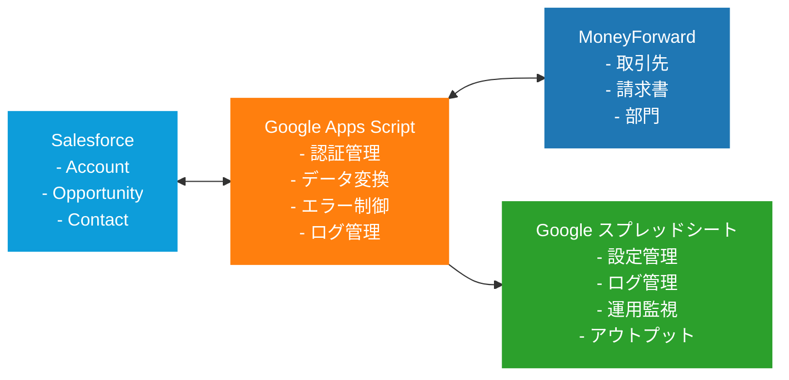

## 1. 概要

### 1.1 目的・背景

**仕様書の目的**

- Salesforce-MoneyForward連携システムの実装・テスト・運用に必要な詳細仕様を定義
- 開発者・テスター・運用者が迷わずに作業できる具体的な実装指針を提供

**対象システムの概要**

- SalesforceとMoneyForwardを統合し、顧客管理から請求書発行までの業務フローを自動化
- Google Apps Script（GAS）を中核とした連携基盤による双方向データ同期
- スプレッドシートを活用した設定管理・ログ管理・運用監視機能

**想定読者とスキルレベル**

- **主読者**: GAS・JavaScript開発者（中～上級レベル）
- **副読者**: システムテスター、運用管理者
- **必要スキル**: OAuth 2.0、REST API、スプレッドシート操作、基本的なSQLESS知識

### 1.2 対象範囲

**仕様化対象の詳細範囲**

- クライアント同期機能（完全同期・増分同期）
- 請求書発行機能（一括発行・進捗管理）
- 運用管理機能（認証管理・ログ管理・監視機能）
- エラーハンドリング・復旧機能

**対象外項目**

- Salesforce・MoneyForward内部のカスタマイズ
- Google Workspace全般の設定・権限管理
- 既存データのマイグレーション手順

**関連ドキュメント**

- 要件定義書：本仕様書の上位ドキュメント
- Salesforce API仕様書：外部参照
- MoneyForward API仕様書：外部参照
- Google Apps Script仕様書：外部参照

### 1.3 前提条件・制約

**技術的前提条件**

- Google Workspace環境への管理者権限
- Salesforce API アクセス権限（標準オブジェクト読み書き）
- MoneyForward API アクセス権限（取引先・請求書操作）
- OAuth 2.0 認証フローの実装知識

**環境・リソース制約**

- Google Apps Script実行時間制限：6分/回
- MoneyForward API制限：100リクエスト/分
- Salesforce API制限：日次制限内での利用
- スプレッドシート行数制限：500万行

## 2. システム構成

### 2.1 全体アーキテクチャ

**コンポーネント間の関係**

- **GAS Hub型アーキテクチャ**: GASが全ての外部システムとの連携を仲介
- **設定外部化**: スプレッドシートによる設定値・フラグ管理
- **ログ集約**: 全ての処理ログをスプレッドシートに一元管理
- **OAuth管理**: GAS PropertiesServiceによる認証情報永続化

### 2.2 技術スタック

| 分類 | 技術・サービス | バージョン | 選定理由 |
| --- | --- | --- | --- |
| **実行基盤** | Google Apps Script | 最新 | Google Workspace統合、OAuth対応 |
| **データ管理** | Google スプレッドシート | 最新 | 設定管理、ログ管理の容易さ |
| **認証** | OAuth 2.0 | 2.0 | 両API標準対応 |
| **通信** | REST API | - | HTTP/HTTPS標準通信 |
| **データ形式** | JSON | - | API標準フォーマット |
| **外部API** | Salesforce REST API | v58.0 |  |
| **外部API** | MoneyForward API | v3 | 現行版 |

### 2.3 環境構成

**本番環境**

- Google Apps Script（本番）
- 本番用スプレッドシート
- Salesforce 本番環境
- MoneyForward 本番環境

**監視・ログ設定**

- GAS実行ログ：Google Cloud Logging
- 業務ログ：スプレッドシート
- エラー通知：Gmail + Slack連携

[Salesforce-MoneyForward データ同期システム仕様書](https://www.notion.so/Salesforce-MoneyForward-21cd48a3c2cb80498c01e28726881fff?pvs=21)

[Salesforce-MoneyForward 請求書・見積書エクスポートシステム仕様書](https://www.notion.so/Salesforce-MoneyForward-21cd48a3c2cb8060bbc2f71711a755c2?pvs=21)
