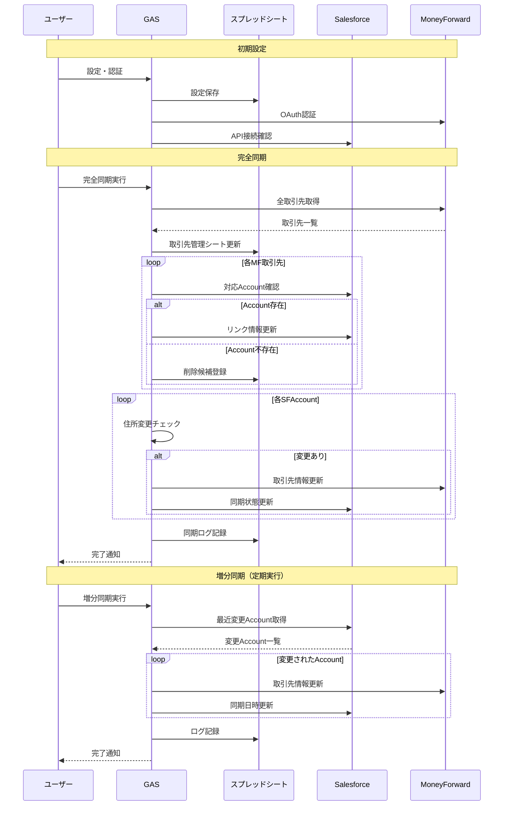

**種別**: A. 一般的なシステム操作・管理マニュアル

**対象読者レベル**: 2. 中級者（基本的なIT操作は可能）

---

## 1. マニュアル概要

### 1.1 目的・対象読者

- **目的**: SalesforceとMoneyForwardの取引先データを自動同期し、データ整合性を維持する
- **対象読者**: システム管理者、営業事務、経理担当者
- **前提スキル**: Google Sheets操作、基本的なシステム管理経験
- **学習時間の目安**: 初回設定30分、日常運用5分

### 1.2 マニュアルの使い方

- **構成**: 初期設定→日常運用→トラブル対応の順で構成
- **表記ルール**:
    - `ボタン名` : クリック対象
    - **重要** : 特に注意が必要な箇所
    - 💡 : 効率化のためのTips
- **関連資料**: Salesforce・MoneyForward各システムのヘルプドキュメント

### 1.3 重要な注意事項

- **データ影響**: 同期処理は実際のデータを変更・削除する可能性があります
- **権限確認**: 両システムの適切な権限が必要です（詳細は事前準備を参照）
- **サポート**: 問題発生時は IT管理者まで連絡してください

---

## 2. 事前準備

### 2.1 必要な権限・アクセス

**Salesforce権限**:

- Account（取引先）の参照・編集権限
- カスタムフィールド `MoneyForward_Partner_ID__c` の編集権限
- API接続用の Connected App設定（管理者作業）

**MoneyForward権限**:

- 取引先の参照・作成・編集権限
- API接続権限

**Google Sheets権限**:

- 対象スプレッドシートの編集権限
- Google Apps Script の実行権限

### 2.2 環境・ツール準備

- **推奨ブラウザ**: Google Chrome最新版
- **ネットワーク**: 安定したインターネット接続
- **Google アカウント**: 組織のGoogle Workspaceアカウント

### 2.3 基礎知識・用語解説

- **同期**: 両システム間でデータの整合性を保つ処理
- **取引先**: Salesforceの Account、MoneyForwardの 取引先（Partner）
- **完全同期**: 全データを対象とした包括的な同期処理
- **増分同期**: 変更された部分のみを対象とした同期処理
- **削除候補**: データ不整合により削除対象となったレコード

---

## 3. 基本操作ガイド

### 3.1 システムへのアクセス

1. Google Sheets で対象のスプレッドシートを開く
2. 上部メニューバーに `MF-SF統合` メニューが表示されることを確認
3. 初回利用時は「初回セットアップ」から開始

### 3.2 初回セットアップ（初回のみ）

1. `MF-SF統合` → `📋 初回セットアップ` をクリック
2. システムの初期設定が自動実行される
3. 「セットアップ完了」のメッセージを確認

💡 **Tips**: セットアップは初回のみ実行。エラーが発生した場合は再実行可能

### 3.3 認証設定（初回のみ）

**MoneyForward認証**:

1. `MF-SF統合` → `認証` → `setupConfig` をクリック
2. Client ID と Client Secret を入力（管理者から提供）
3. `🔑 MoneyForward認証` をクリック
4. 表示されたURLにアクセスして認証を完了

**認証確認**:

1. `✅ 認証テスト` をクリック
2. 「認証が正常に動作しています」のメッセージを確認

### 3.4 システム処理フローの概要

---

## 4. 機能別詳細ガイド

### 4.1 完全同期実行 (※ 基本使用しないこと)

**目的・使用場面**:

- 月1回程度の定期実行
- 大量データの初期同期
- データ不整合の解消

**操作手順**:

1. `MF-SF統合` → `🔄 完全同期実行` をクリック
2. 確認ダイアログで `はい` をクリック
3. 処理完了まで待機（5-20分程度）
4. 完了メッセージで処理結果を確認

**実行結果の確認**:

- **処理件数**: 対象となった取引先の総数
- **成功**: 正常に同期された件数
- **エラー**: 失敗した件数

💡 **Tips**: 処理時間はデータ量に依存。大量データの場合は時間に余裕をもって実行

### 4.2 増分同期実行

**目的・使用場面**:

- 日常的な定期実行（週1-2回）
- 最近変更されたデータのみ同期
- 迅速な同期処理

**操作手順**:

1. `MF-SF統合` → `⚡ 増分同期実行` をクリック
2. 処理完了まで待機（1-5分程度）
3. 完了メッセージで処理結果を確認

**処理対象**:

- 過去24時間で変更されたSalesforce Account
- MoneyForwardとの連携が設定済みの取引先

### 4.3 自動クリーンアップ (※ 基本使用しないこと)

**目的・使用場面**:

- データ品質の維持
- 不整合データの削除
- 月1回程度の実行

**操作手順**:

1. 事前に「DeleteCandidates」シートで削除候補を確認
2. 削除してよい項目のステータスを「APPROVED」に変更
3. `MF-SF統合` → `🧹 自動クリーンアップ` をクリック
4. 確認ダイアログで `はい` をクリック

**⚠️ 重要**: 削除は元に戻せません。事前に削除対象を十分確認してください

### 4.4 定期実行トリガー設定

**目的・使用場面**:

- 自動化の設定・変更
- 定期実行間隔の調整

**操作手順**:

1. 「Config」シートで設定を確認・変更
    - `AUTO_SYNC_ENABLED`: TRUE（自動実行有効）
    - `SYNC_INTERVAL`: 間隔（分単位）
2. `MF-SF統合` → `📊 定期実行トリガー更新` をクリック
3. 設定内容を確認して `はい` をクリック

**設定例**:

- 日次実行: `SYNC_INTERVAL` = 1440（24時間）
- 週次実行: `SYNC_INTERVAL` = 10080（168時間）

**⚠️ 重要**: リリースタイミング(2025年6月24日) では週次実行を設定済み

---

## 5. 業務シーン別活用法

### 5.1 日次業務での活用

**朝の確認作業**:

1. システム状態確認（`⚙️ システム状態確認`）
2. エラーログの確認（ErrorLogシート）
3. 必要に応じて増分同期実行

**月末・月初作業**:

1. 完全同期実行
2. 削除候補の確認・承認
3. 統計レポートの確認

### 5.2 月次・定期業務での活用

**月次メンテナンス**:

1. 完全同期実行による全体整合性確認
2. 削除候補データの精査・承認
3. 自動クリーンアップ実行
4. 統計レポートによる健全性確認

**設定見直し**:

1. 同期間隔の調整（Config シート）
2. 定期実行トリガーの更新
3. 認証状況の確認

### 5.3 緊急時・イレギュラー対応

**データ不整合発生時**:

1. 完全同期実行による修復試行
2. ErrorLog シートでエラー内容確認
3. 必要に応じて手動データ修正
4. IT管理者への報告・相談

**認証エラー発生時**:

1. 認証テストによる状況確認
2. MoneyForward再認証の実行
3. 認証設定の確認・更新

---

## 6. データ管理ガイド

### 6.1 管理用シートの見方

**SyncLog シート**:

- 同期処理の実行履歴
- 処理日時、種別、成功・エラー件数を記録

**ErrorLog シート**:

- エラーの詳細情報
- エラー種別、対象レコード、エラー内容

**DeleteCandidates シート**:

- 削除候補データの一覧
- ステータス管理（PENDING/APPROVED/REJECTED）

**PartnerManagement シート**:

- 取引先の同期状況一覧
- 連携ステータス、最終同期日時

### 6.2 データ品質の確認方法

**同期状況の確認**:

1. PartnerManagement シートを開く
2. 「同期ステータス」列を確認
    - LINKED: 正常連携中
    - NO_LINK: 未連携
    - SF_NOT_FOUND: Salesforce側にデータなし

**エラーの確認**:

1. ErrorLog シートを開く
2. 最新のエラーを確認
3. 必要に応じて該当データを修正

---

## 7. トラブルシューティング

### 7.1 よくある問題・対処法

**「認証に失敗しました」エラー**:

- **原因**: 認証トークンの期限切れ
- **対処法**: MoneyForward再認証を実行
- **手順**: `認証` → `🔑 MoneyForward認証`

**「処理がタイムアウトしました」エラー**:

- **原因**: 大量データによる処理時間超過
- **対処法**: データを分割して処理、または処理時間の短い増分同期を利用

**「取引先が見つかりません」エラー**:

- **原因**: Salesforce側のデータ不整合
- **対処法**: Salesforceで該当Accountの存在を確認、必要に応じて手動修正

### 7.2 システム関連問題

**「メニューが表示されない」**:

- **対処法**: スプレッドシートを再読み込み
- **手順**: ブラウザでF5キーまたは更新ボタンをクリック

**「権限エラー」が発生する**:

- **原因**: 必要権限の不足
- **対処法**: IT管理者に権限設定を依頼

**処理が途中で止まる**:

- **原因**: ネットワーク接続不安定
- **対処法**: 安定したネットワーク環境での再実行

### 7.3 データ関連問題

**削除候補が多数表示される**:

- **原因**: データ品質の問題、過去の設定不備
- **対処法**:
    1. DeleteCandidatesシートで内容を精査
    2. 削除してよいものは「APPROVED」に変更
    3. 保持すべきものは「REJECTED」に変更

**同期されない取引先がある**:

- **確認点**:
    - 顧客コードの形式（SF:xxxxx形式）
    - MoneyForward_Partner_ID__c の設定
    - 両システムでのデータ存在確認

---

## 8. FAQ・よくある質問

### 8.1 操作・機能に関するFAQ

**Q: 完全同期と増分同期はどう使い分けるべきですか？**

A: 日常的には増分同期を使用してください(自動トリガー設定済み)。完全同期はSalesforce側に大きな変更があった場合などに使用するようにしてください

**Q: 自動実行を設定したのに動作しません**

A: Config シートの AUTO_SYNC_ENABLED が TRUE に設定されているか確認してください。

**Q: 削除候補になったデータは必ず削除すべきですか？**

A: いいえ。削除候補は自動検出ですが、最終判断は運用者が行います。必要なデータは「REJECTED」として保持してください。

### 8.2 業務・運用に関するFAQ

**Q: エラーが発生した場合の報告基準は？**

A: 連続して5件以上のエラー、または認証エラーが発生した場合はIT管理者に報告してください。

**Q: 手動でデータを修正した場合の注意点は？**

A: 手動修正後は増分同期を実行して、両システムの整合性を確認してください。

### 8.3 技術・システムに関するFAQ

**Q: 処理に時間がかかる場合の対処法は？**

A: Google Apps Scriptには6分の実行時間制限があります。大量データの場合は分割実行、または処理対象を限定してください。

**Q: 他のユーザーも同時に操作できますか？**

A: 同期処理は1つずつ実行してください。複数ユーザーでの同時実行は避けてください。

**Q: バックアップは必要ですか？**

A: 重要なデータ変更前には、各システムでデータのエクスポートによるバックアップを推奨します。

---

**最終更新**: 2024年12月

**マニュアル版本**: 1.0
